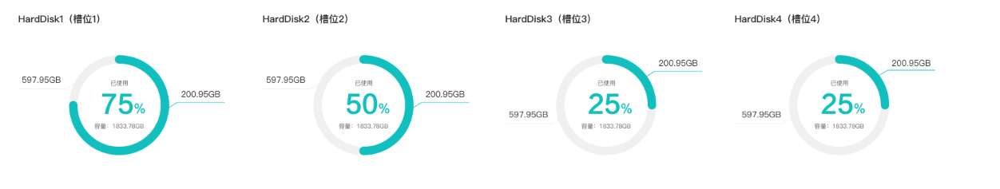

##Flex布局使用遇到的坑

1. 子盒子flex-grow属性有值时，父盒子的justify-content属性失效（显性失效，但实际没有失效）
2. IE浏览器在使用`flex:1;`时，会被解析为`flex: 1 1 0;` ，所以要使用`flex-grow: 1`代替；

## Echarts使用遇到的坑

### Echarts使用方法：

1. 安装echarts `npm install --save echarts`
2. 为Echarts准备一个具备宽高的容器
3. 初始化echarts实例

* 当网速不佳时，执行初始化图表函数会遇见图表盒子DOM节点还未创建，拿不到该节点从而导致渲染图表失败的情况。解决方法如下：

  1. 利用标签的ref属性替代标签的id或class属性 ---- 用于初始化图表实例时，拿到装图表的DOM
  2. 使用this.$nextTick()方法

  举一个栗子

  

```js
//以下是利用vue实现的echarts图表渲染,动态渲染多个图表
// 为Echarts准备一个具备宽高的容器 
<template>
	<div v-if="diskList.length > 0">
      <div style="display:inline-block"
           v-for="(item,index) in diskList" 
           :key="item.diskId" >
        <span class="config-font">{{item.diskName}}(槽位号{{index+1}})</span>
        <div :ref="item.idname"
            style="width:350px;height:300px">
        </div>
      </div>
    </div>
</template>
<script>
import echarts from 'echarts';
export default {
	data(){
        return{
            diskList: [] //从后端获取的数据
        }
    },
    methods: {
        initCharts() {
            for(let i = 0; i < this.diskList.length; i++ ) {
              let _this = this;
              let ref = _this.diskList[i].idname;
              _this.$nextTick(() => {
                let dom = _this.$refs[ref];
                let diskPie = echarts.init(dom[0]);
                diskPie.setOption(_this.hardDiskOption(_this.diskList[i]));
              })
            }
        }，
        hardDiskOption(data){ 
        let available = data.availbleSize,
            total = data.totalSize,
            used = total - available,
            // diskSpace = (used / total).toFixed(2).split(".")[1] ;
            diskSpace = (used / total).toFixed(2) ;
            // console.log("diskpace:",(used / total).toFixed(2));
        return {
          graphic: [
            {　　　　　　　　　　　　　　　　
              type: 'text',　　　　　　　　　　　　
              left: 'center',　　　　　　　　　　
              top: '36%',
              style: {　　　　　　　　　　　　　　　　
                  text: "已使用",
                  textAlign: 'center',
                  fill: '#000',　　　　　　　
                  width: 30,
                  height: 30,
                  fontSize: 10,
                  color: "#4d4f5c",
              }
            },
            {
              type: 'text',
              left: 'center',
              top: '45%',
              style: {
                  text: diskSpace,
                  textAlign: 'center',
                  fill: 'rgb(18,191,191)',
                  width: 30,
                  height: 30,
                  fontSize: 34,
                  fontWeight: 600
              }
            },
            {
              type: 'text',
              left: '60%',
              top: '48%',
              style: {
                  text: "%",
                  fill: '#000',
                  width: 30,
                  height: 30,
                  fontSize: 20,
              }
            },
            {
              type: 'text',
              left: 'center',
              top: '60%',
              style: {
                  text: '容量: ' + Filters.ramUnitTransform(total),
                  textAlign: 'center',
                  fill: '#000',
                  width: 30,
                  height: 30,
                  fontSize: 12,
              }
            }
          ], 
          color: ["#12BFBF", "#F0F0F0"],
          series: [
            {
              center: ["50%","50%"],
              type: "pie",
              radius: [70,90],
              data: [
                {
                  name: Filters.ramUnitTransform(used),
                  value: used
                },
                {
                  name: Filters.ramUnitTransform(available),
                  value: available,
                  itemStyle: {
                  emphasis: {
                    color: "#f0f0df"
                }
              },
                }
              ],
              labelLine: {
                normal: {
                  length2: 95,
                }
              },
              label: {
                normal: {
                  formatter: '{b|{b}}\n\n',
                  padding: [0,-90],
                  rich: {
                    b: {
                      color: '#2C2C2C',
                      fontSize: 14,
                    }
                  }
                },
              }
            },
          ]
        }
      }
    }
}
</script>
```

## vue父组件传参到子组件的坑

1.当父组件传给子组件的参数为引用类型时，子组件直接修改父组件穿过来的值，不会报错（实际应该报错的）------- 发现场景：EUS项目分割画面的画面模式